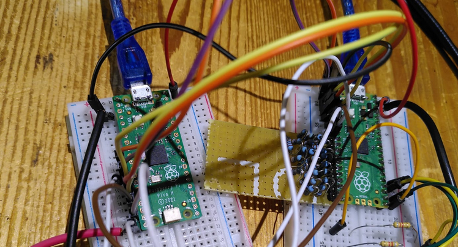

# Picoconnect


If you have more than one Raspi Pico connected to a computer, things can get confusing. Which Pico is on which port?
Maybe the name of the ports have even changed since the last time you connected, so noting the port names is no solution.
Pycoconnector is a Python library that helps to find  a defined Pico, execute commands on it etc.)

### Working principle
Each Pico has a file info.txt in the root folder. The first line of this file contains a keyword under which the Pico can be found. The picoconnector_xx.py lib has functions to find this and connect.
I have described the first ideas in more detail here:
[website] http://staff.ltam.lu/feljc/electronics/uPython/Pico_communication.pdf

### Versions

The first versions were based on communication in normal REPL mode. The advantage is that debugging is easyer. The disadvantage is that it is a bit slow.
I am developing a new version picoconnect_paxx.py that uses the paste mode.

### Code example for picoconnect_pa01:
```python
from picoconnect_pa01 import create_pico_dictionary, Pico, CMD_TEST

keyword = "SWISS"

create_pico_dictionary()
mypico = Pico(keyword)
mypico.connect()
mypico.execute(CMD_TEST)
mypico.execute("x = 5; print (2* 3.14 * x)")
mypico.list_files()
mypico.read_file("main.py")
mypico.close()

# Here no print function is used, as most functions have printflag = True by default
# Anyway the respose is also returned by the functions
```   


### Code example for picoconnector_xx (using REPL mode)
```python
from picoconnector_01 import scan_for_picos, scan_picoinfo, Pico
import time


if __name__ == "__main__":
    
    ''' You can have info on all Picos connected'''
    picos = scan_for_picos()
    
    
    #scan_picoinfo()
    
    
    '''You can connect to one special Pico
    This must contain the keyword in the first line of a file info.txt
    on the Pico'''
    keyword = 'PWMgenerator_02'
    ##keyword = ''      #-> first Pico found with or without info.txt
    mypico = Pico(keyword)
    mypico.connect()
    
    ''' The connected attribute tells if the connection was successful'''
    if mypico.connected:
        
        ''' You can interrupt a program (e.g. started by main.py at boot)
        or reset (reboot) the Pico'''
        mypico.reset()
        mypico.interrupt_prog()
        time.sleep(0.1)
        
        
        '''Commands can be sent and executed:'''
        #mypico.send_cmd("import time", verbose = False)
        #mypico.send_cmd("import time", verbose = True)
        mypico.set_rawREPL()
        mypico.send_cmd("3.14*5")
        print()
        print("Back to normal REPL")
        mypico.set_normalREPL()
        mypico.send_cmd("3.14*5")
        print()
        
        '''You can list the files on the Pico (except those in subfolders)'''
        print("Files on Pico:")
        files = mypico.list_files() 
        for f in files:
            print(f)
        
    
    '''Close the connection'''
    mypico.close()
```    
 ## Connector GUI in REPL mode
 After trying to use the picoconnector module with a pure tkinter GUI, where everything was nicely decoupled, I came back to use something I had developed earlier: a textbox class directly connected to the serial interface.
This made it much easier. The result is found in the gui folder. Feel free to improve it.


